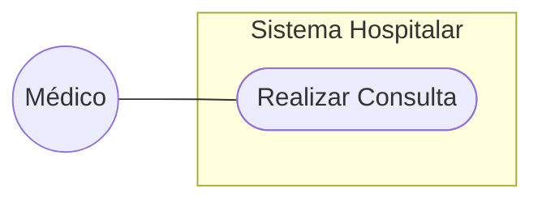

# Modelagem de Casos de Uso

## 1. Diagrama de Casos de Uso
*(Inserir imagem ou Mermaid)*

## 2. Especificação
### UC001 - Consulta
* **Ator**: Médico.
* **Fluxo**: Consultar paciente -> Avaliar necessidade de tratamento -> Emitir APAC -> Assinar APAC.

#### [CARE-UC001] Implementação da Consulta
* **Context**: Paciente identificado e autenticado.
* **Action**: Extrair dados do prontuário eletrônico e processar com a LLM.
* **Result**: Dados de formulário exibidos numa interface WEB semelhante ao formulário APAC.
* **Evaluation**: Teste unitário deve validar tempo de resposta da página WEB.
