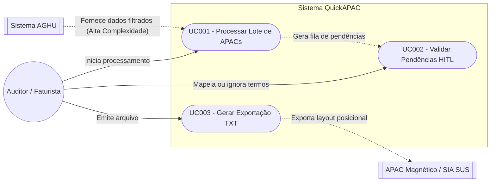

# Modelagem de Casos de Uso

## 1. Diagrama de Casos de Uso

## 2. Especificação

### UC001 - Processar lote de APAC
* **Ator Principal**: Analista de faturamento (Ernani).
* **Ator Secundário**: Sistema AGHU.
* **Fluxo**: Analista solicita o processamento → Sistema faz a requisição de extração para o AGHU → Sistema processa com base no seu banco de dados o dados vindos do AGHU.

#### [CARE-UC001] Processar lote de APAC
* **Context (Contexto)**: Usuário clica no botão para iniciar o processamento em lote do dia.
* **Action (Ação)**: Extrair dados estruturados e prontuários do AGHU, normalizar os textos e buscar as palavras-chave no Dicionário local.
* **Result (Resultado)**: Separação por status: APACs mapeadas com sucesso (PRONTA) e APACs com termos desconhecidos (PENDENTE).
* **Evaluation (Avaliação)**: Injetar um payload mockado do AGHU nos testes e garantir que o sistema retorna os arrays de prontas e pendentes corretamente.

### UC002 - Validar pendências de dicionário (HITL)
* **Ator**: Analista de faturamento (Ernani).
* **Fluxo**: Sistema exibe lista de termos não reconhecidos → Analista lê o contexto e preenche os códigos corretos → Sistema salva no banco e reprocessa a APAC.

#### [CARE-UC002] Validar pendências de dicionário
* **Context (Contexto)**: O processamento (UC001) não encontrou palavras conhecidas.
* **Action (Ação)**: Fornecer formulário na interface para o usuário preencher o CID/Procedimento correspondente àquela palavra e salvar a alteração.
* **Result (Resultado)**: Nova associação termo-código adicionada ao banco de dados e o status da APAC do paciente é atualizado para PRONTA.
* **Evaluation (Avaliação)**: Teste de API (`POST /dicionario`): Inserir um novo mapeamento no banco e validar se uma nova busca pela mesma palavra agora retorna o código correto em vez de NULL.

### UC003 - Gerar Arquivo de Exportação
* **Ator**: Analista de faturamento (Ernani).
* **Fluxo**: Analista seleciona as APACs resolvidas e clica em exportar → Sistema formata os dados nos tamanhos de bytes corretos → Sistema gera o download do arquivo `.txt`.

#### [CARE-UC003] Exportação
* **Context (Contexto)**: Todas as pendências de dicionário foram resolvidas.
* **Action (Ação)**: Acionar o script de formatação posicional, conforme layout do Datasus.
* **Result (Resultado)**: Geração e download do arquivo `.txt`.
* **Evaluation (Avaliação)**: Gerar um arquivo falso no ambiente de teste e passar por um validador de bytes, garantindo que a linha do "Header" e do "Corpo" tenham exatamente os tamanhos exigidos pelo manual do governo.
