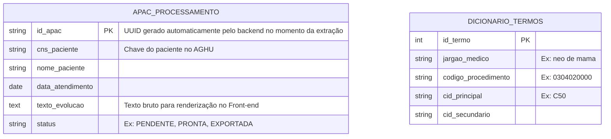

# Modelo de Dados

## 1. Diagrama de Entidade e Relacionamento (ER)

## 2. Dicionário de dados

### 2.1. Tabela: APAC_PROCESSAMENTO
* Função: Tabela de transição. Armazena os dados de um lote de pacientes extraído do AGHU apenas para o ciclo de validação visual e geração do faturamento.
* Regra de Negócio: A fonte da verdade do paciente continua sendo o AGHU. O campo texto_evolucao é guardado aqui apenas para que o Front-end possa renderizar a tela de "Highlight" (grifa-texto) para o Ernani ler e interagir. Assim que o lote for exportado (status = EXPORTADA), esses registros podem ser rotacionados ou arquivados.

### 2.2. Tabela: DICIONARIO_TERMOS
* Função: O cérebro do mapeamento semântico. Funciona como uma tabela de equivalência (De-Para) consultada pelo back-end (Hash Table).
* Regra de Negócio: É alimentada exclusivamente pelas interações de Ernani no Front-end. Quando o Analista seleciona um trecho de texto livre que não estava grifado e informa os códigos, um novo registro é feito nesta tabela, garantindo que no próximo lote aquela expressão exata já seja mapeada de forma automática.
